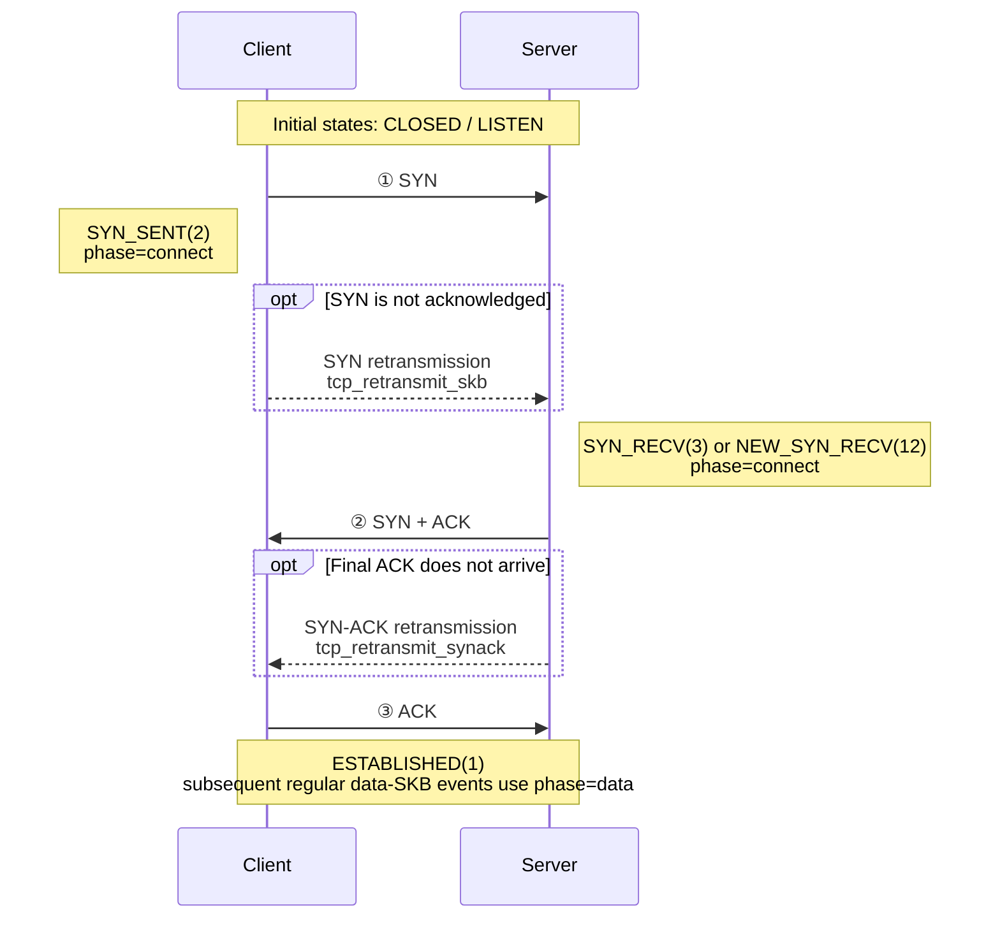

{}
<div style="text-align: left;">
HUATUO is an OS-level deep observability project open-sourced by DiDi and incubated under CCF (China Computer Federation). It provides kernel-level deep observability for cloud-native general computing, AI computing, cloud services, and infrastructure services.
</div>
{}

## Overview

`tcpshark --mode retransmit` observes TCP retransmission-related kernel activity through the `tcp/tcp_retransmit_skb` and `tcp/tcp_retransmit_synack` tracepoints. It can also observe the `tcp_send_loss_probe` kprobe when TLP collection is explicitly enabled. Depending on the event type, an event can include the IP 4-tuple, TCP state, congestion-control state, retransmission counters, sequence information, and socket metadata used for container resolution.

The userspace classifier derives a connection phase and a reason label from the event type, `sk_state`, `ca_state`, and reorder counters. These labels are operational heuristics, not packet-loss root-cause proof.

Filter expressions are compiled at load time by `internal/pcapfilter` and run in the kernel. The SKB, SYN-ACK, and TLP hooks always evaluate the expression against the same synthetic L3 TCP packet, with or without local correlation. Protocol, address, network, and port conditions are supported. Ethernet addresses, payload, real packet lengths, IP/TCP options, and raw byte-offset expressions are not available. Safe ethertype checks such as `ether proto ip` are rewritten for L3. A pair of IPv4-mapped IPv6 socket addresses is filtered as IPv4; the raw perf record remains AF_INET6 and userspace normalizes the addresses before matching. In local correlation mode, tcpshark also applies the exact same expression to embedded dropwatch. Use a direction-symmetric expression when reverse ACK or SYN-ACK evidence must remain in scope.

---

## Scenarios

### 1. TCP Network Quality and Retransmission Diagnosis

Continuously observe RTO, fast retransmission, reorder-prone retransmission, and TLP events to identify abnormal retransmissions during connection establishment, data transfer, and connection teardown. These signals help investigate packet loss, congestion, reordering, and peer reachability problems.

### 2. Kubernetes Container Network Troubleshooting

Use the container ID, network namespace, and socket cgroup metadata to identify the workload experiencing retransmissions. Apply `--filter "tcp and port <service-port>"` to focus on a specific service and reduce interference from other host connections.

### 3. Application Latency and Throughput Anomaly Analysis

Align TCP retransmission events with application latency, error-rate, and throughput timelines. This helps determine whether RTOs or repeated retransmissions coincide with service degradation and distinguish slow application processing from underlying network problems.

### 4. Locating Packet Loss with dropwatch Correlation

Run tcpshark in local correlation mode to correlate retransmissions with packet drops in the same process. Matching checks the network namespace, tuple direction, TCP sequence or ACK evidence, and kernel monotonic ordering. A strict match identifies an observed host software drop. A no-match remains `unknown` because source readiness does not establish that the retransmission's earlier causal history was observed.

---

## Usage

### 1. Running tcpshark

```text
tcpshark --mode retransmit [flags]
```

| Flag | Default | Description |
|------|---------|-------------|
| `--mode retransmit` | required | Select TCP retransmission tracing mode. |
| `--enable-tlp`, `--tlp` | disabled | Also attach `tcp_send_loss_probe` and emit TLP events. |
| `--bpf-path <path>` | required without correlation | Path to one `tcp_retransmit.o` file. |
| `--bpf-path-dir <dir>` | required with correlation | Directory containing `tcp_retransmit.o` and `net_dropwatch.o`. |
| `--with-dropwatch` | disabled | Load embedded dropwatch and correlate it with retransmissions. |
| `--filter <expr>` | (none) | L3-compatible tcpdump-style filter for all retransmit hooks; also shared with embedded dropwatch in local mode; see §2. |
| `--duration <n>` | 0 | Stop after N seconds (0 = run until Ctrl-C). |
| `--max-events-per-second <n>` | 0 | BPF-side event rate limit; 0 means unlimited. |
| `--output <json\|text>` | `text` | Output format; ignored when `--output-storage` is set. |
| `--output-storage <path>` | (none) | Send events to huatuo-bamai over a Unix socket. |
| `--task-id <id>` | (none) | Task ID for the toolstream session; requires `--output-storage`. |

When both `--output` and `--output-storage` are explicitly specified, `--output` is ignored and a warning is printed.

#### 1.1 Examples

```bash
# Text output for all retransmission-related events
sudo tcpshark --mode retransmit --bpf-path bpf/tcp_retransmit.o

# NDJSON output
sudo tcpshark --mode retransmit --bpf-path bpf/tcp_retransmit.o --output json

# BPF-side filter for regular retransmitted SKBs to one destination host and port
sudo tcpshark --mode retransmit --bpf-path bpf/tcp_retransmit.o --filter "dst host 10.0.0.1 and dst port 443"

# Correlate locally; both BPF inputs use the same direction-symmetric filter
sudo tcpshark --mode retransmit --with-dropwatch --bpf-path-dir bpf \
  --filter "tcp and port 443"

# Include Tail Loss Probe events (disabled by default)
sudo tcpshark --mode retransmit --enable-tlp --bpf-path bpf/tcp_retransmit.o

# Emit at most 100 events/second; overflow prints a rate limit hit log
sudo tcpshark --mode retransmit --bpf-path bpf/tcp_retransmit.o \
  --max-events-per-second 100

# Filter all formatted event types to destination port 443 in userspace
sudo tcpshark --mode retransmit --bpf-path bpf/tcp_retransmit.o --output json \
  | jq -c 'select(.tcp_dport == 443)'

# Keep only events classified as RTO for 60 seconds
sudo tcpshark --mode retransmit --bpf-path bpf/tcp_retransmit.o --duration 60 --output json \
  | jq -c 'select(.tcp_reason == "RTO")'

# Forward events to a running huatuo-bamai instance
sudo tcpshark --mode retransmit --bpf-path bpf/tcp_retransmit.o \
  --output-storage /var/run/huatuo-toolstream.sock
```

`jq -c` emits compact single-line JSON, which is convenient for NDJSON files and downstream pipelines.

#### 1.2 Integration with huatuo-bamai

tcpshark uses the same `--output-storage` and toolstream flow as dropwatch. For the common storage workflow, refer to the [dropwatch documentation](/docs/best-practice/dropwatch_en.md). TCP retransmission tracing adds the following configuration:

```toml
[EventTracing.TCPRetransmit]
    # Used by tcpshark in both modes. Default: empty.
    Filter = ""

    # Forwarded as tcpshark --enable-tlp. Default: false.
    EnableTLP = false

    # Run tcpshark with an embedded dropwatch source. Default: false.
    EnableDropwatchCorrelation = false

    # Forwarded as tcpshark --max-events-per-second. Default: 100; 0 disables it.
    MaxEventsPerSecond = 100
```

`EventTracing.TCPRetransmit.Filter` controls retransmission collection in both
modes. With local correlation disabled, an empty value passes no `--filter`
flag. With local correlation enabled, the normalized expression is passed to
both tcpshark inputs and an empty value becomes `tcp`.
`EventTracing.Dropwatch.Filter` remains independent and controls only
standalone dropwatch.

The `tcp_retransmit` tracer is in the global `BlackList` by default. Remove it
from the list and restart huatuo-bamai to enable the tracer. Standalone
`dropwatch` may remain blacklisted because local correlation owns a private
dropwatch source.

---

### 2. Filter Expressions

tcpshark uses the same tcpdump-style filter expressions as dropwatch. For complete syntax, limitations, and additional examples, refer to the [dropwatch documentation](/docs/best-practice/dropwatch_en.md).

```bash
# Select one destination host and port
--filter "dst host 10.0.0.1 and dst port 443"

# Select traffic in both directions between two networks
--filter "(src net 10.10.0.0/16 and dst net 10.20.0.0/16) or (src net 10.20.0.0/16 and dst net 10.10.0.0/16)"
```

> In local mode the same expression must cover both traffic directions. A directional selector can exclude reverse ACK or SYN-ACK drop evidence and make the result less useful.

> Local mode rejects Ethernet-address primitives such as `ether host 02:00:00:00:00:01`. Ethertype primitives such as `ether proto ip` and `ether proto ip6` are supported because they can be rewritten as raw-IP version checks.

---

### 3. Event Data Structure

Each event is an NDJSON object (`types.TCPRetransmitTracing`). Fields tagged with `omitempty` are absent when their value is empty or zero.

| Field | Type | Description |
|-------|------|-------------|
| `observed_timestamp` | string | UTC userspace receive/format time (RFC3339Nano), not the kernel hook timestamp. |
| `kernel_observed_timestamp` | string | UTC kernel observation time (RFC3339Nano), converted from the raw monotonic clock. |
| `comm` | string | Current kernel execution-context command, not necessarily the socket-owning process. |
| `pid` | uint64 | Current execution-context TGID, not necessarily the socket owner's TGID. |
| `container_id` | string | Container ID when resolved by huatuo-bamai; see §3.2. |
| `memory_cgroup_css_addr` | string | Socket memory-cgroup CSS address in hexadecimal form, used for container resolution. |
| `net_namespace_cookie` | uint64 | Socket network-namespace cookie used for container resolution. |
| `net_namespace_inum` | uint32 | Socket network namespace inum used for container resolution. |
| `tcp_saddr` | string | Source IP address. |
| `tcp_daddr` | string | Destination IP address. |
| `tcp_sport` | uint16 | Source port. |
| `tcp_dport` | uint16 | Destination port. |
| `tcp_state` | string | TCP socket state, such as `ESTABLISHED`, `SYN_SENT`, or `NEW_SYN_RECV`. |
| `phase` | string | Classifier output: `connect`, `data`, or `close`. |
| `tcp_reason` | string | Classifier output: `RTO`, `fast_retransmit`, `TLP`, or `unknown`. |
| `event_type` | string | `tcp_retransmit_skb`, `tcp_retransmit_synack`, or `tcp_send_loss_probe`. |
| `ca_state` | uint8 | Congestion-control state: 0=Open, 1=Disorder, 2=CWR, 3=Recovery, 4=Loss. |
| `icsk_retransmits` | uint8 | Current retransmission counter snapshot. |
| `icsk_pending` | uint8 | Raw pending timer state from `inet_connection_sock`; see the value table below. |
| `reord_seen` | uint32 | Cumulative flow reorder counter. |
| `dsack_dups` | uint32 | Cumulative DSACK duplicate counter. |
| `tcp_seq` | uint32 | `TCP_SKB_CB(skb)->seq` for SKB events; `snd_nxt` for TLP; request `snt_isn` for SYN-ACK when available. |
| `tcp_ack_seq` | uint32 | `tcp_sk(sk)->rcv_nxt` for SKB events; `snd_una` for TLP; request `rcv_nxt` for SYN-ACK when available. |
| `tcp_end_seq` | uint32 | `TCP_SKB_CB(skb)->end_seq` for SKB events; request `snt_isn + 1` for SYN-ACK when available; omitted for TLP. |
| `tcp_flags` | string | Rendered TCP flag set such as `SYN|ACK` or `ACK|PSH`; SKB events use `TCP_SKB_CB(skb)->tcp_flags`, SYN-ACK events derive it from the event type, and TLP events omit it. |
| `skb_addr` | string | Retransmission-queue SKB pointer in hex; absent for SYN-ACK and TLP events. |
| `drop_location` | string | Local correlation result: `host_software` or `unknown`; see §5. |
| `correlation_reasons` | string array | Stable machine-readable reasons why a no-match remains `unknown`. |
| `dropwatch_perf_status` | object | Latest cumulative embedded-dropwatch `perf_lost`, `lost_samples`, and `rate_limited` counters for a no-match; omitted when the status map cannot be read. |
| `drop_stack` | string | Matched drop stack; unmatched stacks are not symbolized. |
| `source` | string | Event source. It is `tools` when tcpshark runs standalone and `events` when huatuo-bamai launches it. |

`icsk_pending` is a timer-state snapshot at the hook, not a stable retransmission-reason enum. TLP classification uses the explicit `event_type=tcp_send_loss_probe` and does not depend on `icsk_pending=5`.

| Value | Kernel state | Meaning |
|------:|--------------|---------|
| `0` | None | No transmit-timer event is currently pending. |
| `1` | `ICSK_TIME_RETRANS` | Retransmission timeout timer (RTO). |
| `2` | `ICSK_TIME_DACK` | Delayed ACK; modern kernels keep this state in `icsk_ack.pending` and use a separate delayed-ACK timer, so it normally does not appear in `icsk_pending`. |
| `3` | `ICSK_TIME_PROBE0` | Zero-window probe timer. |
| `4` | Version-dependent | Current mainline kernels no longer define this value; older kernels used it for Early Retransmit, and still older kernels used it for Keepalive. |
| `5` | `ICSK_TIME_LOSS_PROBE` | Tail Loss Probe (TLP) timer. |
| `6` | `ICSK_TIME_REO_TIMEOUT` | Reordering timeout, primarily used by RACK loss detection. |

#### 3.1 Text Output Format

Text retains its terminal-friendly layout while covering the same event variables as JSON. Optional variables appear only when non-zero or non-empty, and string values are not JSON-quoted or escaped. For compatibility with the original text format, `state`, `skb`, `seq`, `end`, `ack`, `flags`, `ca`, `retrans`, and `reason` correspond to the JSON fields `tcp_state`, `skb_addr`, `tcp_seq`, `tcp_end_seq`, `tcp_ack_seq`, `tcp_flags`, `ca_state`, `icsk_retransmits`, and `correlation_reasons`, respectively.

```text
<timestamp> [<phase>/<tcp_reason>] <saddr>:<sport> > <daddr>:<dport> state=<STATE> event_type=<TYPE> [kernel_observed_timestamp=<UTC>] [SYNACK] [skb=<ADDR>] seq=<N> [end=<N>] ack=<N> [flags=<FLAGS>] pid=<N> comm=<COMM> ca=<N> retrans=<N> icsk_pending=<N> [reord_seen=<N>] [dsack_dups=<N>] [container_id=<ID>] [memory_cgroup_css_addr=<ADDR>] [net_namespace_cookie=<N>] [net_namespace_inum=<N>] [drop_location=<LOCATION>] [reason=<REASON,...>] [dropwatch_perf_lost=<N> dropwatch_lost_samples=<N> dropwatch_rate_limited=<N>] [source=<SOURCE>]
```

Example:

```text
2026-07-23T02:14:40.304775546Z [data/RTO] 127.0.0.1:19996 > 127.0.0.1:42128 state=ESTABLISHED event_type=tcp_retransmit_skb kernel_observed_timestamp=2026-07-23T02:14:40.304Z skb=0xffff931c14fdf800 seq=3154974646 end=3154991030 ack=948393597 flags=ACK|PSH pid=1420 comm=kube-apiserver ca=4 retrans=4 icsk_pending=0 net_namespace_inum=4026531992
```

The `pid` and `comm` in this example describe the execution context in which the hook ran; use `container_id` and socket metadata for workload attribution.

A non-empty `drop_stack` is rendered as indented lines after the event line,
not as an inline `drop_stack=` token.

#### 3.2 Container ID Resolution

tcpshark cannot access the Pod manager directly. In standalone output, `container_id` is normally absent, while socket memcg and network-namespace metadata are still emitted when available. In huatuo-bamai mode, an empty `container_id` is resolved in this order: `memory_cgroup_css_addr`, `net_namespace_cookie`, then `net_namespace_inum`.

If all lookups miss, the event is still stored without `container_id`. Do not use `pid` or `comm` as a fallback for socket ownership because they describe the hook execution context.

---

### 4. Kernel Events and Classification

#### 4.1 Kernel Hook Points

| Hook | Kernel location | What the event means | Data availability |
|------|-----------------|----------------------|-------------------|
| tracepoint `tcp/tcp_retransmit_skb` | `__tcp_retransmit_skb()` | A retransmission was attempted for a retransmission-queue SKB. The tcpshark event does not retain the kernel transmit result. The SKB is headerless, so sequence fields come from `TCP_SKB_CB(skb)` and ACK comes from `tcp_sk(sk)->rcv_nxt`. | SKB pointer, TCP seq/end_seq/ack/flags, socket state, CA state, timers, and reorder counters. |
| tracepoint `tcp/tcp_retransmit_synack` | `tcp_rtx_synack()` | A passive-open SYN-ACK retransmission was successfully submitted by `tcp_rtx_synack()`. | Request-socket addresses and ports; no retransmission SKB pointer or TCP seq/ack. |
| kprobe `tcp_send_loss_probe` | `tcp_send_loss_probe()` | A Tail Loss Probe is being prepared; collected only with `--enable-tlp`. | Socket metadata plus `snd_nxt`/`snd_una`; no SKB pointer or rendered TCP flags. |

The BPF program uses CO-RE field reads (`BPF_CORE_READ` and related helpers), so supported kernel layouts do not require rebuilding the C source for each kernel version.

#### 4.2 Connection Phase

The regular-SKB phase is derived from `sk_state`. SYN-ACK events use a fixed phase in userspace.

The TCP three-way handshake below shows the `connect` phase and its retransmission hook points:



The three solid arrows are the initial handshake packets and do not produce tcpshark events. Only the retransmission paths inside the optional blocks are observed. Active-open SYN retries are reported by `tcp_retransmit_skb`, while passive-open SYN-ACK retries are reported by `tcp_retransmit_synack`; both are classified as `connect`.

The complete phase mapping is:

| Phase | Source state or event | Description |
|-------|-----------------------|-------------|
| `connect` | SYN_SENT(2), SYN_RECV(3), NEW_SYN_RECV(12), or `tcp_retransmit_synack` | Connection establishment. |
| `data` | ESTABLISHED(1) or unrecognized/default states | Data transfer/default classification. |
| `close` | FIN_WAIT1(4), FIN_WAIT2(5), TIME_WAIT(6), CLOSE_WAIT(8), LAST_ACK(9), CLOSING(11) | Connection teardown. |

#### 4.3 Reason Classification

| Event or condition | Reason | Interpretation |
|--------------------|--------|----------------|
| `tcp_retransmit_synack` | `RTO` | Fixed userspace label for the SYN-ACK retry timer path. |
| `tcp_send_loss_probe` | `TLP` | Fixed userspace label for the optional Tail Loss Probe hook. |
| `tcp_retransmit_skb`, `ca_state=4` (Loss) | `RTO` | The socket is in TCP_CA_Loss. |
| `tcp_retransmit_skb`, `ca_state=3` (Recovery) | `fast_retransmit` | Recovery-path retransmission. |
| `tcp_retransmit_skb`, `ca_state=0..2`, connect/close phase | `RTO` | Phase-based fallback used by the current classifier. |
| `tcp_retransmit_skb`, `ca_state=0..2`, data phase | `unknown` | The available snapshots are insufficient to assign another label. |

The classifier observes socket state at the hook and cannot reconstruct the complete ACK/loss history. Treat `tcp_reason` as a grouping label rather than a verified root cause.

#### 4.4 Reorder Heuristic


#### 4.5 Operational Guidance

No event type is unconditionally safe to discard. Prefer rate, ratio, and service-impact thresholds over filtering solely by `event_type` or `tcp_reason`. For the common huatuo-bamai noise-filtering mechanism, refer to the [dropwatch documentation](/docs/best-practice/dropwatch_en.md).

| Pattern | Typical priority | Guidance |
|---------|------------------|----------|
| `tcp_reason=RTO` | High | Investigate sustained or service-correlated increases; RTO normally has greater latency impact than Recovery-path retransmission. |
| `tcp_reason=fast_retransmit` | Medium | Correlate with loss, congestion, and SACK/RACK behavior. |
| `tcp_reason=TLP` | Context dependent | Optional signal only; confirm that TLP collection was deliberately enabled before using it in alerting. |
| `event_type=tcp_retransmit_synack` | Usually low per isolated retry | Repeated events can indicate handshake reachability, host egress, firewall, or client/network problems. |

When building alerts, aggregate by service or connection and compare against traffic volume. A small absolute count on a busy host can be benign, while a burst affecting a low-volume critical service can be significant.

---

### 5. Correlation with dropwatch

With `--with-dropwatch`, one tcpshark process owns both perf inputs. A retransmission waits up to 100 ms for a delayed dropwatch delivery. A candidate drop must precede the retransmission by no more than one second in kernel monotonic time. The embedded source never emits raw drop documents; separately enabled standalone dropwatch remains an independent raw-event stream.

#### 5.1 Correlation Results

| Result | Required evidence | Output |
|--------|-------------------|--------|
| Outbound segment match | Same network namespace, family, direction, tuple, monotonic ordering, and overlapping SYN/data/FIN sequence range. | `host_software` with `drop_stack`. |
| Reverse ACK match | Reverse tuple in the same namespace, ACK flag set, monotonic ordering, and ACK covering the retransmitted sequence end. | `host_software` with `drop_stack`. |
| No strict match | Negative evidence is not conclusive because source startup does not cover earlier causal history. Other coverage failures are listed separately. | `unknown` with `correlation_reasons` and `dropwatch_perf_status`. |

There is no tuple-only, SKB-pointer-only, cross-namespace, or ambiguous positive match. A drop that satisfies every check except namespace is reported as `cross_netns_candidate`, not matched. A matched drop is consumed once, while later drops on the same connection remain available. Stack symbolization runs only after a match.

#### 5.2 Unknown Reasons

| Reason | Meaning |
|--------|---------|
| `no_matching_drop` | No strict drop candidate was found before the 100 ms wait expired. |
| `startup_history_incomplete` | Observation began without a reliable causal-start boundary for the retransmission. |
| `cross_netns_candidate` | Drop evidence passed tuple, time, and sequence checks but belongs to another network namespace. |
| `perf_events_lost` / `drop_rate_limited` | Evidence was lost before userspace or rejected by the embedded rate limiter. |
| `retransmit_wait_capacity_exceeded` | The bounded retransmission wait queue reached capacity. |
| `unsupported_retransmission` | The retransmission lacks the event type, namespace, time, or sequence evidence required for strict matching. |
| `dropwatch_perf_status_unavailable` | The latest embedded perf counters could not be read; the no-match is still emitted once without `dropwatch_perf_status`. |

Drop records that cannot be normalized and drop candidates evicted from the bounded cache do not add per-retransmission reasons. If no strict match is found, the result remains `unknown` with `no_matching_drop`.

When collection ends or any worker fails, tcpshark does not read dropwatch
records still queued in the perf ring. Retransmissions already waiting in the
correlator are finalized in deadline order through the normal no-match path:
they receive `drop_location=unknown`, `no_matching_drop`, any other applicable
reasons, and the latest available `dropwatch_perf_status`. An unread tail drop
could otherwise have matched a shutdown result.

#### 5.3 Dropwatch Perf Status

Every no-match reports the latest available counters:

| Field | Meaning |
|-------|---------|
| `perf_lost` | Cumulative losses from this embedded dropwatch perf input. It does not include tcpshark or unrelated perf streams. |
| `lost_samples` | Cumulative samples reported by reader-side `PERF_RECORD_LOST` records. |
| `rate_limited` | Cumulative events rejected by this embedded dropwatch rate limiter. |

These counters describe the current BPF load and reset when the object is
loaded again. No-matches finalized during normal operation or shutdown are not
reused after reload.

#### 5.4 Requirements and Troubleshooting

| Observation | Checks |
|-------------|--------|
| `host_software` | Inspect the matched stack together with tuple, direction, sequence, and namespace evidence. |
| `unknown` with loss counters | Narrow the shared filter, increase perf capacity, or adjust the embedded dropwatch rate limit, then capture again. |
| `unknown` with `no_matching_drop` | No strict candidate arrived within 100 ms; inspect the other reasons and capture a wider traffic scope if needed. |
| `unknown` with `cross_netns_candidate` | Inspect the named namespace independently; cross-namespace evidence is never promoted to a positive match. |
| `unknown` with `startup_history_incomplete` | A no-match cannot exclude a software drop that occurred before the embedded source became ready. |
| `drop_location` absent | Expected in `off` mode. |

huatuo-bamai passes one normalized `EventTracing.TCPRetransmit.Filter` value to both local-correlation inputs. Keeping those scopes identical prevents the two sources from observing different traffic, but it does not make a no-match conclusive without a reliable causal-start boundary.

---

## Closing

{}
<div style="text-align: center;">
Stars welcome: <a href="https://github.com/ccfos/huatuo" target="_blank">https://github.com/ccfos/huatuo</a>
</div>
{}
