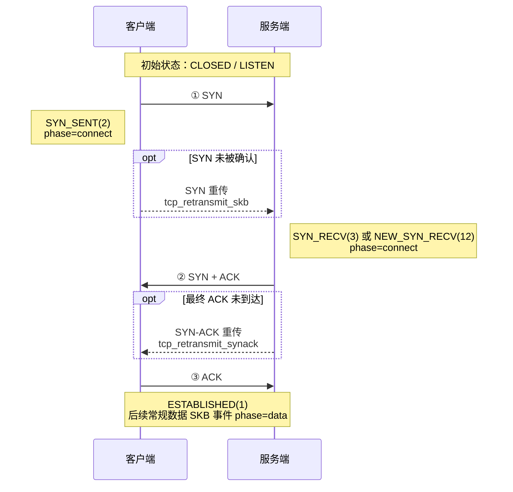

{}
<div style="text-align: left;">
HUATUO（华佗）是由滴滴开源并依托 CCF（中国计算机学会）孵化的操作系统深度观测项目，广泛应用于AI 计算、AI 沙箱、云原生通用计算、云服务、基础架构服务等场景。
</div>
{}

## 📖 概述

`tcpshark --mode retransmit` 通过内核跟踪点 `tcp/tcp_retransmit_skb` 和 `tcp/tcp_retransmit_synack` 观测 TCP 重传相关活动。显式开启 TLP 后，还会观测 `tcp_send_loss_probe` kprobe。根据事件类型，每条事件可携带 IP 四元组、TCP 状态、拥塞控制状态、重传计数器、序列号信息，以及用于解析容器归属的 socket 元数据。

用户态分类器根据事件类型、`sk_state`、`ca_state` 和乱序计数器生成连接阶段与原因标签。这些标签是用于运维分析的启发式分类，不是丢包根因的确定性证据。

过滤表达式由 `internal/pcapfilter` 在加载时编译并在内核中执行。无论是否开启 local 关联，SKB、SYN-ACK 和 TLP 三个 hook 都对同一种合成 L3 TCP 报文执行过滤。支持协议、地址、网段和端口条件；不提供以太网地址、payload、真实包长、IP/TCP options 或原始 byte-offset 语义。`ether proto ip` 等安全的 ethertype 判断会转换为 L3 判断。一对 IPv4-mapped IPv6 socket 地址按 IPv4 执行过滤；原始 perf record 仍保留 AF_INET6，用户态在匹配前规范化地址。local 关联模式还会把完全相同的表达式用于 embedded dropwatch。需要保留反向 ACK 或 SYN-ACK 证据时，应使用方向对称的表达式。

---

## 🎯 场景

### 1. TCP 网络质量与重传诊断

通过持续观测 RTO、快速重传、乱序倾向重传和 TLP 事件，识别连接建立、数据传输及连接关闭阶段的异常重传，辅助判断网络丢包、拥塞、乱序或对端不可达等问题。

### 2. Kubernetes 容器网络故障排查

结合容器 ID、网络命名空间和 socket cgroup 元数据定位发生重传的工作负载，并使用 `--filter "tcp and port <service-port>"` 聚焦特定服务流量，减少宿主机上其他连接的干扰。

### 3. 应用延迟与吞吐毛刺分析

将 TCP 重传事件与应用延迟、错误率和吞吐曲线对齐，分析 RTO 或连续重传是否与服务性能下降同时发生，辅助区分应用处理变慢与底层网络异常。

### 4. 与 dropwatch 关联定位丢包位置

使用 tcpshark local 模式在同一进程内关联重传与丢包。匹配会检查 network namespace、四元组方向、TCP sequence 或 ACK 证据及内核单调时间顺序。严格匹配表示观测到了宿主机软件丢包。no-match 保持 `unknown`，因为 source ready 不能证明更早的因果历史已经被观测。

---

## 🚀 使用

### 1. 运行 tcpshark

```text
tcpshark --mode retransmit [flags]
```

| 参数 | 默认值 | 说明 |
|------|--------|------|
| `--mode retransmit` | 必填 | 选择 TCP 重传追踪模式。 |
| `--enable-tlp`、`--tlp` | 关闭 | 同时挂载 `tcp_send_loss_probe` 并输出 TLP 事件。 |
| `--bpf-path <path>` | 非关联模式必填 | 单个 `tcp_retransmit.o` 文件路径。 |
| `--bpf-path-dir <dir>` | 关联模式必填 | 同时包含 `tcp_retransmit.o` 和 `net_dropwatch.o` 的目录。 |
| `--with-dropwatch` | 关闭 | 加载 embedded dropwatch 并与重传关联。 |
| `--filter <expr>` | （无） | 三个重传 hook 共用的 L3 兼容 tcpdump 风格过滤器；local 模式下也与 embedded dropwatch 共用，见 §2。 |
| `--duration <n>` | 0 | 运行 N 秒后退出（0 表示持续运行直至 Ctrl-C）。 |
| `--max-events-per-second <n>` | 0 | BPF 侧事件限速，0 表示不限速。 |
| `--output <json\|text>` | `text` | 输出格式；设置 `--output-storage` 时会被忽略。 |
| `--output-storage <path>` | （无） | 通过 Unix socket 将事件发送给 huatuo-bamai。 |
| `--task-id <id>` | （无） | toolstream 会话关联的任务 ID；必须与 `--output-storage` 一起使用。 |

显式同时指定 `--output` 和 `--output-storage` 时，`--output` 会被忽略并打印警告。

#### 1.1 常用命令

```bash
# 文本格式输出全部重传相关事件
sudo tcpshark --mode retransmit --bpf-path bpf/tcp_retransmit.o

# NDJSON 格式输出
sudo tcpshark --mode retransmit --bpf-path bpf/tcp_retransmit.o --output json

# 在 BPF 侧过滤指定目标主机和端口的常规重传 SKB
sudo tcpshark --mode retransmit --bpf-path bpf/tcp_retransmit.o --filter "dst host 10.0.0.1 and dst port 443"

# 本地关联；两个 BPF 输入使用同一个方向对称 filter
sudo tcpshark --mode retransmit --with-dropwatch --bpf-path-dir bpf \
  --filter "tcp and port 443"

# 包含 Tail Loss Probe 事件（默认关闭）
sudo tcpshark --mode retransmit --enable-tlp --bpf-path bpf/tcp_retransmit.o

# 最多输出 100 条事件/秒；超限时打印 rate limit hit 日志
sudo tcpshark --mode retransmit --bpf-path bpf/tcp_retransmit.o \
  --max-events-per-second 100

# 在用户态过滤全部格式化事件类型，只保留目标端口 443
sudo tcpshark --mode retransmit --bpf-path bpf/tcp_retransmit.o --output json \
  | jq -c 'select(.tcp_dport == 443)'

# 运行 60 秒，仅保留分类为 RTO 的事件
sudo tcpshark --mode retransmit --bpf-path bpf/tcp_retransmit.o --duration 60 --output json \
  | jq -c 'select(.tcp_reason == "RTO")'

# 将事件转发给正在运行的 huatuo-bamai 实例
sudo tcpshark --mode retransmit --bpf-path bpf/tcp_retransmit.o \
  --output-storage /var/run/huatuo-toolstream.sock
```

`jq -c` 将每条结果压缩成单行 JSON，便于保存为 NDJSON 或继续通过管道处理。

#### 1.2 与 huatuo-bamai 集成

tcpshark 与 dropwatch 使用相同的 `--output-storage` 和 toolstream 流程。通用存储方式请参考 [dropwatch 文档](/docs/best-practice/dropwatch_zh.md)。TCP 重传追踪增加以下配置：

```toml
[EventTracing.TCPRetransmit]
    # 两种模式都由 tcpshark 使用；默认空值。
    Filter = ""

    # 设置为 true 时传入 tcpshark --enable-tlp；默认 false。
    EnableTLP = false

    # 使用 embedded dropwatch；默认 false。
    EnableDropwatchCorrelation = false

    # 传给 tcpshark --max-events-per-second；默认 100，0 表示不限速。
    MaxEventsPerSecond = 100
```

`EventTracing.TCPRetransmit.Filter` 在两种模式下都控制重传采集。关闭 local
关联时，空值不传 `--filter`。开启 local 关联时，规范化后的表达式同时传给
tcpshark 的两个输入，空值规范化为 `tcp`。`EventTracing.Dropwatch.Filter`
保持独立，只控制 standalone dropwatch。

`tcp_retransmit` tracer 默认位于全局 `BlackList` 中。需要启用时，应将其移除并
重启 huatuo-bamai。local 关联使用私有 dropwatch source，因此 standalone
`dropwatch` 可以继续位于黑名单中。

---

### 2. 过滤表达式

tcpshark 使用与 dropwatch 相同的 tcpdump 风格过滤表达式。完整语法、限制和更多示例请参考 [dropwatch 文档](/docs/best-practice/dropwatch_zh.md)。

```bash
# 指定目标主机和端口
--filter "dst host 10.0.0.1 and dst port 443"

# 观察两个网段之间的双向流量
--filter "(src net 10.10.0.0/16 and dst net 10.20.0.0/16) or (src net 10.20.0.0/16 and dst net 10.10.0.0/16)"
```

> local 模式下，同一个表达式必须覆盖两个流量方向。方向性 selector 可能排除反向 ACK 或 SYN-ACK drop 证据，降低结果可信度。

> local 模式拒绝 `ether host 02:00:00:00:00:01` 等依赖以太网地址的 primitive。`ether proto ip` 和 `ether proto ip6` 可转换为 raw-IP version 判断，因此受支持。

---

### 3. 事件数据结构

每条事件以 NDJSON 对象（`types.TCPRetransmitTracing`）表示。带 `omitempty` 标签的字段在值为空或零时不会输出。

| 字段 | 类型 | 说明 |
|------|------|------|
| `observed_timestamp` | string | 用户态接收/格式化事件时生成的 UTC 时间（RFC3339Nano），不是内核 hook 时间。 |
| `kernel_observed_timestamp` | string | 内核观测事件的 UTC 时间（RFC3339Nano），由原始单调时钟转换。 |
| `comm` | string | 当前内核执行上下文的进程名，不一定是 socket 所属进程。 |
| `pid` | uint64 | 当前执行上下文的 TGID，不一定是 socket 所属进程的 TGID。 |
| `container_id` | string | huatuo-bamai 解析出的容器 ID，见 §3.2。 |
| `memory_cgroup_css_addr` | string | 用于解析容器归属的 socket 内存 cgroup CSS 十六进制地址。 |
| `net_namespace_cookie` | uint64 | 用于解析容器归属的 socket 网络命名空间 cookie。 |
| `net_namespace_inum` | uint32 | 用于解析容器归属的 socket 网络命名空间 inum。 |
| `tcp_saddr` | string | 源 IP 地址。 |
| `tcp_daddr` | string | 目的 IP 地址。 |
| `tcp_sport` | uint16 | 源端口。 |
| `tcp_dport` | uint16 | 目的端口。 |
| `tcp_state` | string | TCP socket 状态，如 `ESTABLISHED`、`SYN_SENT` 或 `NEW_SYN_RECV`。 |
| `phase` | string | 分类结果：`connect`、`data` 或 `close`。 |
| `tcp_reason` | string | 分类结果：`RTO`、`fast_retransmit`、`TLP` 或 `unknown`。 |
| `event_type` | string | `tcp_retransmit_skb`、`tcp_retransmit_synack` 或 `tcp_send_loss_probe`。 |
| `ca_state` | uint8 | 拥塞控制状态：0=Open、1=Disorder、2=CWR、3=Recovery、4=Loss。 |
| `icsk_retransmits` | uint8 | 当前重传计数器快照。 |
| `icsk_pending` | uint8 | `inet_connection_sock` 中原始的待处理定时器状态，取值见下表。 |
| `reord_seen` | uint32 | 连接累计乱序计数器。 |
| `dsack_dups` | uint32 | 累计 DSACK 重复计数器。 |
| `tcp_seq` | uint32 | SKB 事件使用 `TCP_SKB_CB(skb)->seq`；TLP 使用 `snd_nxt`；字段可用时 SYN-ACK 使用 request `snt_isn`。 |
| `tcp_ack_seq` | uint32 | SKB 事件使用 `tcp_sk(sk)->rcv_nxt`；TLP 使用 `snd_una`；字段可用时 SYN-ACK 使用 request `rcv_nxt`。 |
| `tcp_end_seq` | uint32 | SKB 事件使用 `TCP_SKB_CB(skb)->end_seq`；字段可用时 SYN-ACK 使用 request `snt_isn + 1`；TLP 中省略。 |
| `tcp_flags` | string | 渲染后的 TCP flag 集合，如 `SYN|ACK`、`ACK|PSH`；SKB 事件来自 `TCP_SKB_CB(skb)->tcp_flags`，SYN-ACK 事件由事件类型派生，TLP 事件中省略。 |
| `skb_addr` | string | 十六进制重传队列 SKB 指针；SYN-ACK 和 TLP 事件中不存在。 |
| `drop_location` | string | local 关联结果：`host_software` 或 `unknown`，见 §5。 |
| `correlation_reasons` | string array | no-match 保持 `unknown` 的稳定、机器可读原因。 |
| `dropwatch_perf_status` | object | no-match 定型时最新的 embedded dropwatch 累计 `perf_lost`、`lost_samples` 和 `rate_limited`；状态 map 读取失败时省略。 |
| `drop_stack` | string | 匹配到的 drop 调用栈；未匹配的栈不做符号化。 |
| `source` | string | 事件来源。独立运行 tcpshark 时为 `tools`，由 huatuo-bamai 启动时为 `events`。 |

`icsk_pending` 是 hook 时刻的定时器状态快照，不是重传原因的稳定枚举。TLP 分类以明确的 `event_type=tcp_send_loss_probe` 为准，不依赖 `icsk_pending=5`。

| 值 | 内核状态 | 含义 |
|---:|----------|------|
| `0` | None | 当前没有待处理的发送定时器事件。 |
| `1` | `ICSK_TIME_RETRANS` | 重传超时定时器（RTO）。 |
| `2` | `ICSK_TIME_DACK` | 延迟 ACK；现代内核将该状态保存在 `icsk_ack.pending` 并使用独立的 delayed-ACK timer，因此通常不会出现在 `icsk_pending` 中。 |
| `3` | `ICSK_TIME_PROBE0` | 零窗口探测定时器。 |
| `4` | 版本相关 | 当前主线内核不再定义该值；旧内核曾将其用于 Early Retransmit，更早的内核曾用于 Keepalive。 |
| `5` | `ICSK_TIME_LOSS_PROBE` | Tail Loss Probe（TLP）定时器。 |
| `6` | `ICSK_TIME_REO_TIMEOUT` | 乱序超时定时器，主要用于 RACK 丢包判断。 |

#### 3.1 文本输出格式

文本输出保留面向终端的可读布局，同时覆盖与 JSON 相同的事件变量。可选变量仅在非零或非空时显示，字符串值不添加 JSON 引号或转义。为兼容原文本格式，`state`、`skb`、`seq`、`end`、`ack`、`flags`、`ca`、`retrans` 和 `reason` 分别对应 JSON 中的 `tcp_state`、`skb_addr`、`tcp_seq`、`tcp_end_seq`、`tcp_ack_seq`、`tcp_flags`、`ca_state`、`icsk_retransmits` 和 `correlation_reasons`。

```text
<timestamp> [<phase>/<tcp_reason>] <saddr>:<sport> > <daddr>:<dport> state=<STATE> event_type=<TYPE> [kernel_observed_timestamp=<UTC>] [SYNACK] [skb=<ADDR>] seq=<N> [end=<N>] ack=<N> [flags=<FLAGS>] pid=<N> comm=<COMM> ca=<N> retrans=<N> icsk_pending=<N> [reord_seen=<N>] [dsack_dups=<N>] [container_id=<ID>] [memory_cgroup_css_addr=<ADDR>] [net_namespace_cookie=<N>] [net_namespace_inum=<N>] [drop_location=<LOCATION>] [reason=<REASON,...>] [dropwatch_perf_lost=<N> dropwatch_lost_samples=<N> dropwatch_rate_limited=<N>] [source=<SOURCE>]
```

示例：

```text
2026-07-23T02:14:40.304775546Z [data/RTO] 127.0.0.1:19996 > 127.0.0.1:42128 state=ESTABLISHED event_type=tcp_retransmit_skb kernel_observed_timestamp=2026-07-23T02:14:40.304Z skb=0xffff931c14fdf800 seq=3154974646 end=3154991030 ack=948393597 flags=ACK|PSH pid=1420 comm=kube-apiserver ca=4 retrans=4 icsk_pending=0 net_namespace_inum=4026531992
```

示例中的 `pid` 和 `comm` 表示 hook 运行时的执行上下文；工作负载归属应使用 `container_id` 和 socket 元数据判断。

非空的 `drop_stack` 会作为事件行之后的缩进调用栈行输出，不使用行内 `drop_stack=` token。

#### 3.2 容器 ID 解析

tcpshark 自身无法访问 Pod 管理器。独立输出时通常没有 `container_id`，但可用时仍会输出 socket memcg 和网络命名空间元数据。通过 huatuo-bamai 运行时，空的 `container_id` 按 `memory_cgroup_css_addr`、`net_namespace_cookie`、`net_namespace_inum` 的顺序解析。

全部解析未命中时，事件仍会存储，但 `container_id` 保持为空。`pid` 和 `comm` 描述的是 hook 执行上下文，不能作为判断 socket 归属的回退依据。

---

### 4. 内核事件与分类

#### 4.1 内核挂载点

| 挂载点 | 内核位置 | 事件含义 | 可用数据 |
|--------|----------|----------|----------|
| tracepoint `tcp/tcp_retransmit_skb` | `__tcp_retransmit_skb()` | 对一个重传队列 SKB 发起了重传尝试；tcpshark 事件不保留内核发送结果。该 SKB 是 headerless 的，因此序列号来自 `TCP_SKB_CB(skb)`，ACK 来自 `tcp_sk(sk)->rcv_nxt`。 | SKB 指针、TCP seq/end_seq/ack/flags、socket 状态、CA 状态、定时器和乱序计数器。 |
| tracepoint `tcp/tcp_retransmit_synack` | `tcp_rtx_synack()` | `tcp_rtx_synack()` 成功提交了一次被动建连 SYN-ACK 重传。 | request socket 地址和端口；没有重传 SKB 指针及 TCP seq/ack。 |
| kprobe `tcp_send_loss_probe` | `tcp_send_loss_probe()` | 正在准备 Tail Loss Probe；仅在指定 `--enable-tlp` 时采集。 | socket 元数据及 `snd_nxt`/`snd_una`；没有 SKB 指针或渲染后的 TCP flags。 |

BPF 程序通过 `BPF_CORE_READ` 等辅助方法执行 CO-RE 字段读取，因此在支持的内核布局上无需为每个内核版本重新编译 C 源码。

#### 4.2 连接阶段

常规 SKB 事件的阶段由 `sk_state` 决定；SYN-ACK 事件在用户态使用固定阶段。

下面以 TCP 三次握手说明 `connect` 阶段及对应的重传观测点：



图中的三条实线表示首次握手报文，不会产生 tcpshark 事件；只有可选框中的重传路径会被观测。主动端 SYN 重传通过 `tcp_retransmit_skb` 上报，被动端 SYN-ACK 重传通过 `tcp_retransmit_synack` 上报，两者都归类为 `connect`。

完整阶段映射如下：

| 阶段 | 来源状态或事件 | 说明 |
|------|----------------|------|
| `connect` | SYN_SENT(2)、SYN_RECV(3)、NEW_SYN_RECV(12) 或 `tcp_retransmit_synack` | 连接建立。 |
| `data` | ESTABLISHED(1) 或无法识别/默认状态 | 数据传输或默认分类。 |
| `close` | FIN_WAIT1(4)、FIN_WAIT2(5)、TIME_WAIT(6)、CLOSE_WAIT(8)、LAST_ACK(9)、CLOSING(11) | 连接关闭。 |

#### 4.3 原因分类

| 事件或条件 | 原因 | 含义 |
|------------|------|------|
| `tcp_retransmit_synack` | `RTO` | SYN-ACK 重试定时器路径的固定用户态标签。 |
| `tcp_send_loss_probe` | `TLP` | 可选 Tail Loss Probe hook 的固定用户态标签。 |
| `tcp_retransmit_skb`，`ca_state=4`（Loss） | `RTO` | socket 当前处于 TCP_CA_Loss。 |
| `tcp_retransmit_skb`，`ca_state=3`（Recovery） | `fast_retransmit` | Recovery 路径重传。 |
| `tcp_retransmit_skb`，`ca_state=0..2`，connect/close 阶段 | `RTO` | 当前分类器使用的阶段回退结果。 |
| `tcp_retransmit_skb`，`ca_state=0..2`，data 阶段 | `unknown` | 当前快照不足以生成其他标签。 |

分类器只观察 hook 时刻的 socket 状态，无法重建完整的 ACK/丢包历史。因此应把 `tcp_reason` 视为聚合标签，而不是经过验证的根因。

#### 4.4 乱序启发式判断


#### 4.5 运维解读

没有任何事件类型可以无条件丢弃。相比只按 `event_type` 或 `tcp_reason` 过滤，更推荐按速率、比例和服务影响设置阈值。通用的 huatuo-bamai 噪声过滤机制请参考 [dropwatch 文档](/docs/best-practice/dropwatch_zh.md)。

| 模式 | 通常优先级 | 建议 |
|------|------------|------|
| `tcp_reason=RTO` | 高 | 排查持续增长或与服务异常相关的 RTO；它通常比 Recovery 路径重传带来更大延迟影响。 |
| `tcp_reason=fast_retransmit` | 中 | 结合丢包、拥塞及 SACK/RACK 行为分析。 |
| `tcp_reason=TLP` | 视上下文而定 | 这是可选信号；用于告警前应确认已主动开启 TLP 采集。 |
| `event_type=tcp_retransmit_synack` | 单次通常较低 | 重复出现可能意味着握手可达性、主机出口、防火墙、客户端或网络问题。 |

配置告警时，应按服务或连接聚合并结合流量规模判断。繁忙主机上的少量绝对计数可能无害，而低流量关键服务上的突发事件可能具有较大影响。

---

### 5. 与 dropwatch 关联

指定 `--with-dropwatch` 后，一个 tcpshark 进程持有两条 perf 输入。重传最多等待 100ms，让较晚送达用户态的 dropwatch 事件参与匹配；候选 drop 的内核单调时间必须早于重传且相差不超过 1s。embedded source 不输出 raw drop 文档；独立启用的 standalone dropwatch 仍是另一条 raw event stream。

关于双 perf stream 的读取乱序、100ms 到达窗口、1s 因果窗口及 negative evidence 的限制，参见
[TCP retransmit 与 dropwatch 关联的难点](/docs/development/tcp_retransmit_dropwatch_correlation_zh.md)。

#### 5.1 关联结果

| 结果 | 必须满足的证据 | 输出 |
|------|----------------|------|
| 出方向 segment 匹配 | network namespace、地址族、方向、四元组、单调时间顺序相同，且 SYN/data/FIN sequence range 重叠。 | `host_software` 和 `drop_stack`。 |
| 反方向 ACK 匹配 | 相同 namespace 中的反向四元组、ACK flag、单调时间顺序，且 ACK 覆盖重传 sequence end。 | `host_software` 和 `drop_stack`。 |
| 无严格匹配 | source 启动时间不能覆盖更早的因果历史，负向证据不完整；其他 coverage 缺口由原因字段区分。 | `unknown`、`correlation_reasons` 和 `dropwatch_perf_status`。 |

不存在仅四元组、仅 SKB pointer、跨 namespace 或 ambiguous 的正向匹配。除 namespace 外满足 tuple、时间和 sequence 条件的证据只输出 `cross_netns_candidate`，不会正向匹配。匹配到的 drop 只消费一次，同一连接的后续 drop 仍可继续匹配。只有成功匹配后才做调用栈符号化。

#### 5.2 Unknown 原因

| 原因 | 含义 |
|------|------|
| `no_matching_drop` | 100ms 等待到期时没有找到严格匹配的 drop。 |
| `startup_history_incomplete` | 开始观测时没有可靠的重传因果起点边界。 |
| `cross_netns_candidate` | drop 满足 tuple、时间和 sequence 条件，但位于另一个 network namespace。 |
| `perf_events_lost` / `drop_rate_limited` | 证据在到达用户态前丢失，或被 embedded 限速器拒绝。 |
| `retransmit_wait_capacity_exceeded` | 有界重传等待队列已满。 |
| `unsupported_retransmission` | 重传缺少严格匹配需要的事件类型、namespace、时间或 sequence 证据。 |
| `dropwatch_perf_status_unavailable` | 无法读取最新 embedded perf 计数；no-match 仍只输出一次，但不带 `dropwatch_perf_status`。 |

无法规范化的 drop 记录和从有界缓存中淘汰的 drop 候选不再产生重传级原因。没有找到严格匹配时，结果仍为 `unknown` 并包含 `no_matching_drop`。

采集结束或任一 worker 失败时，不再读取 dropwatch perf ring 中尚未交给关联器的
尾部记录。关联器中仍在等待的重传按 deadline 顺序通过正常 no-match 路径定型，
输出 `drop_location=unknown`、`no_matching_drop`、其他适用原因和当时可读取的
`dropwatch_perf_status`。未读取的尾部 drop 原本仍可能与 shutdown 结果匹配。

#### 5.3 Dropwatch Perf Status

每个 no-match 都会输出当时可读取的最新计数：

| 字段 | 含义 |
|------|------|
| `perf_lost` | 本次 embedded dropwatch perf 输入的累计丢失；不包含 tcpshark 或其他 perf stream。 |
| `lost_samples` | 用户态 reader 从 `PERF_RECORD_LOST` 记录累计的丢失样本数。 |
| `rate_limited` | 本次 embedded dropwatch 被限速拒绝的累计事件数。 |

这些 counter 绑定当前 BPF load；重新加载时归零。正常运行或 shutdown 时已经
定型的 no-match 不会在 reload 后继续复用。

#### 5.4 使用条件与排查方式

| 观测结果 | 检查项 |
|----------|--------|
| `host_software` | 结合 tuple、方向、sequence、namespace 检查匹配栈。 |
| `unknown` 且 loss counter 非零 | 收紧共同 filter、增大 perf 容量或调整 embedded dropwatch 限速后重新采集。 |
| `unknown` 且包含 `no_matching_drop` | 100ms 内没有严格候选；结合其他原因判断，必要时扩大采集范围。 |
| `unknown` 且包含 `cross_netns_candidate` | 单独检查该 namespace；跨 namespace 证据不会提升为正向匹配。 |
| `unknown` 且包含 `startup_history_incomplete` | no-match 无法排除 embedded source ready 之前的软件丢包。 |
| `drop_location` 不存在 | `off` 模式。 |

huatuo-bamai 会向 local 关联的两个输入传入同一个规范化 `EventTracing.TCPRetransmit.Filter`。采集范围一致可以避免两个 source 观察不同流量，但在缺少可靠因果起点边界时，no-match 仍不能成为确定结论。

---

## 🌟 结尾

{}
<div style="text-align: center;">
🌟 欢迎 Star: <a href="https://github.com/ccfos/huatuo" target="_blank">https://github.com/ccfos/huatuo</a>
<br><br>
👀 欢迎订阅官方微信公众号<br>

</div>
{}
